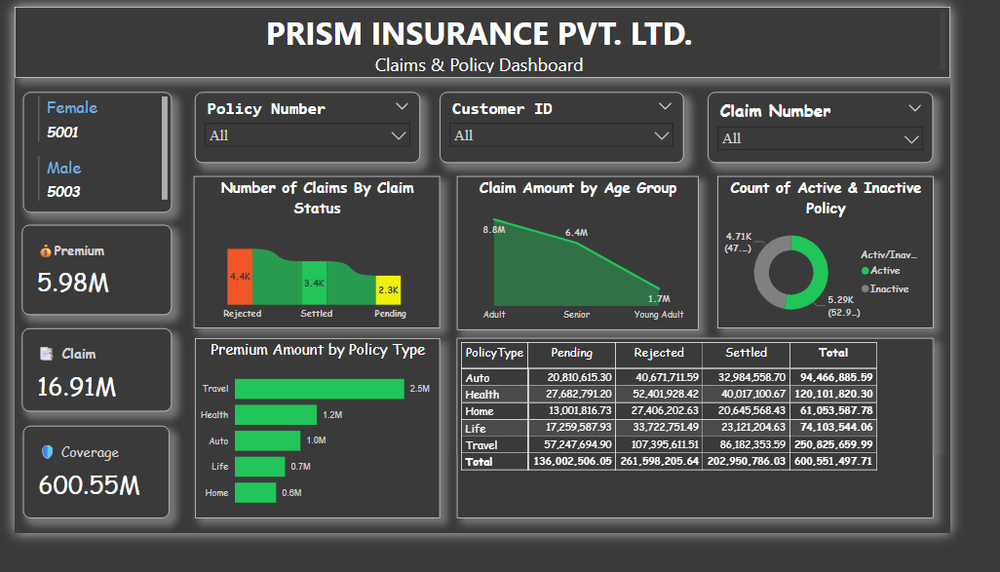
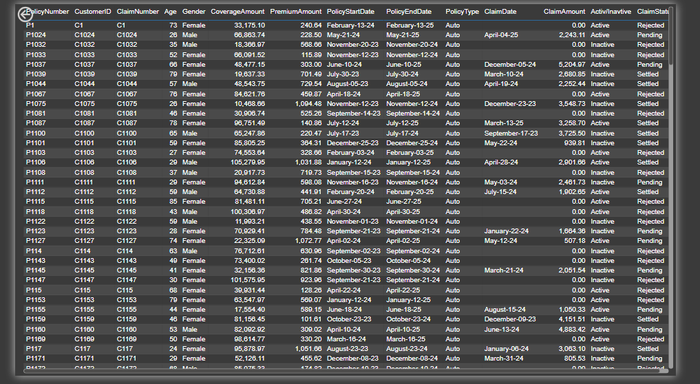
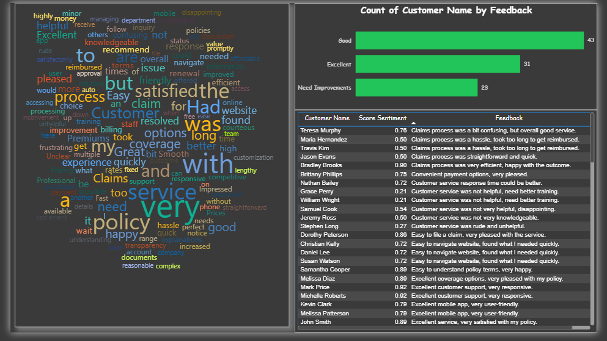

# Prism Insurance - Claims & Policy Analysis (SQL + Power BI)

📊 An interactive **Power BI dashboard** built on synthetic insurance data (imported from **SQL Server**) to analyze **policies, claims, coverage, and customer feedback sentiment**.

## 🔹 Project Overview
- **Objective**: Provide insights into insurance claim trends, customer demographics, and feedback sentiment to improve decision-making.
- **Tools**: SQL Server (data import & cleaning), Power BI, Python (for Sentiment Analysis), Word Cloud Visual.

## 🔹 Features
1. **Page 1 - Executive Dashboard**
   - Premium, Claims, Coverage KPIs
   - Claims by Status, Policy Type, and Age Group
   - Active vs Inactive Policies
   - Drill-through navigation to details

2. **Page 2 - Claims Table**
   - Full policy and claim details
   - Drill-through to page 1 for specific analysis

3. **Page 3 - Customer Feedback**
   - Python-powered **sentiment analysis** (0–1 score)
   - Categorized into: *Excellent, Good, Needs Improvement*
   - Interactive Word Cloud from customer reviews

## 🔹 Key Insights
- ~47% policies active vs 53% inactive
- Travel insurance has highest premium contributions
- Majority of claims are settled, but pending/rejected still significant
- Customer feedback highlights **service speed** and **policy clarity** as improvement areas

## 🔹 How to Use
- Open `Insurance_Dashboard.pbix` in Power BI Desktop
- Data is imported from **SQL Server** but can be refreshed or replaced with live company data
- Explore visuals across 3 pages

## 🔹 Screenshots

---
👨‍💻 *Developed by [Your Name](https://linkedin.com/in/your-profile)*  
